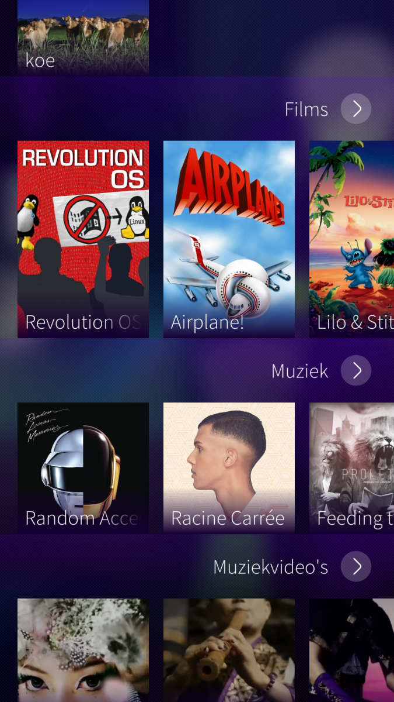
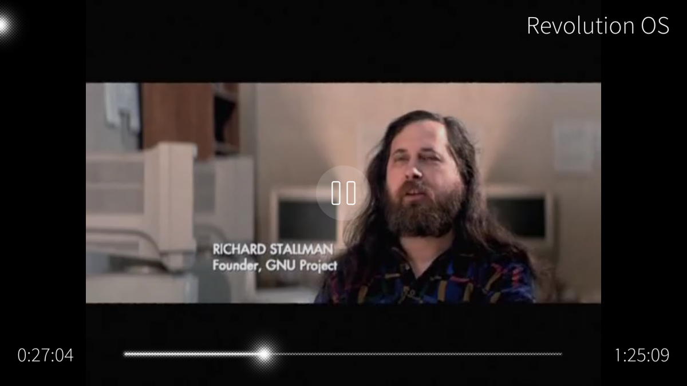

# Sailfin
Sailfin is a [Sailfish OS](https://sailfishos.org) client for [Jellyfin](https://jellyfin.org), a media server, written in C++ and qml.

## Screenshots (running on Sailfish OS)
  

## License
This application is licensed under the LGPLv2.1 license, although you may opt to choose a newer version of the LGPL if you want so.
